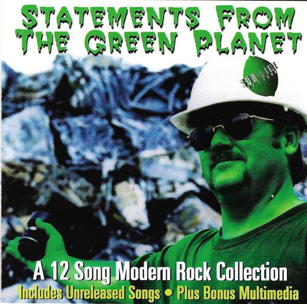
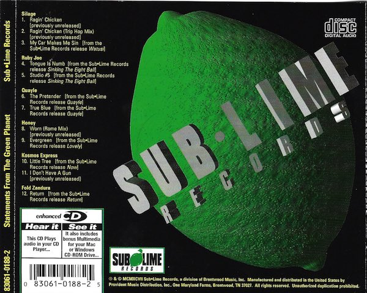

<h2>Statements From The Green Planet</h2>

Statements From The Green Planet is a Sublime Records sampler released in 1997 that features 2 exclusive Silage tracks as well as My Car Makes Me Sin off Watusi.  Statements was also an enhanced CD that included a Quicktime video for <a href='/videos.html'>Watusi</a> and other Sublime band videos and music.

  <strong>Track List:</strong>

  <ol>
  <li>Silage - Ragin' Chicken</li>
  <li>Silage - Ragin' Chicken (Trip Hop Mix)</li>
  <li>Silage - My Car Makes Me Sin</li>
  <li>Ruby Joe - Tounge is Numb</li>
  <li>Ruby Joe - Studio #5</li>
  <li>Quayle - The Pretender</li>
  <li>Quayle - True Blue</li>
  <li>Honey - Worn (Rome Mix)</li>
  <li>Honey - Evergreen</li>
  <li>Kosmos Express - Little Tree</li>
  <li>Kosmos Express - I Don't Have a Gun</li>
  <li>Fold Zandura - Return</li>
  </ol>

Damian Horne 
Lance Black 
Shane Black

