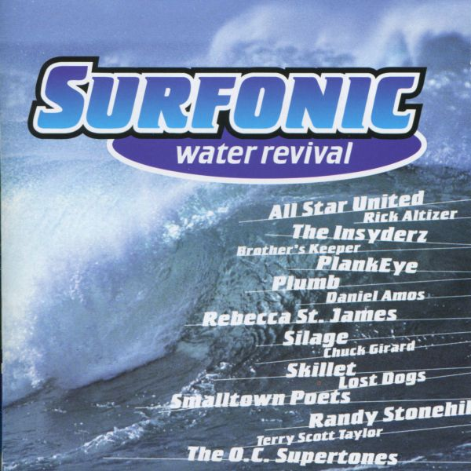

<h2>Surfonic Water Revival</h2>

Surfonic Water Revival is a compilation that was released in the summer of 1998.  Silage contributed the song Sister Marian Trench.

<a href="https://open.spotify.com/album/6KDMGPz3pi6jwdNXnYAHPs" target="_blank">You can listen to Surfonic Water Revival on Spotify</a>.

  <strong>Track List:</strong>

  <ol>
  <li>Wave Perfect - Small Town Poets</li>
  <li>California Blue - Brother's Keeper with Phil Keaggy</li>
  <li>A Good Sailor Knows - The Insyderz</li>
  <li>Endless Summer (Part 2) - Chuck Girard with Paul Johnson</li>
  <li>Surfer Girl Replies - Plumb</li>
  <li>Into the Deep - Terry Scott Taylor</li>
  <li>Thrill Seeker - Plankeye</li>
  <li>The Sun Comes Down Again - Randy Stonehill with Havalina Rail Co.</li>
  <li>Pay For Surf - Daniel Amos</li>
  <li>Gold Coast - Rebecca St. James</li>
  <li>Sister Mariana Trench - Silage</li>
  <li>Surfer's Paradise - All Star United with Phil Keaggy</li>
  <li>Oyster - Rick Altizer</li>
  <li>Last Day of Summer - Skillet</li>
  <li>Caught Inside - The O.C. Supertones</li>
  <li>The Net - Lost Dogs</li>
  <li>Wave Perfect (Instrumental) - Paul Johnson</li>
  </ol>

