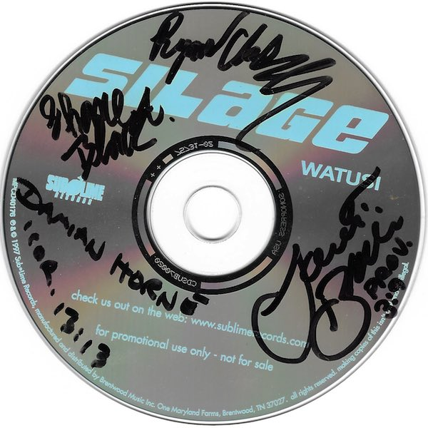
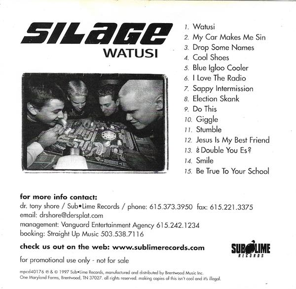
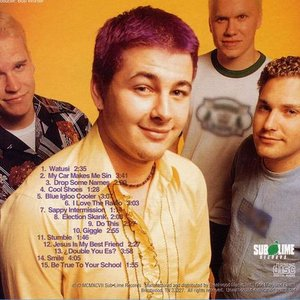

<h2>Watusi</h2>

1997

<a href="https://open.spotify.com/album/2DX8O5jDtosdD2OT3OCi0C" target="_blank">You can listen to Watusi on Spotify</a>.

The above scans are of my promotional copy of Watusi I received from Silage management company Straight Up Music.  It was autographed at my first Silage show.

  <strong>Track List:</strong>

  <ol>
  <li>Watusi</li>
  <li>My Car Makes Me Sin</li>
  <li>Drop Some Names</li>
  <li>Cool Shoes</li>
  <li>Blue Igloo Cooler</li>
  <li>I Love The Radio</li>
  <li>Sappy Intermission</li>
  <li>Election Skank</li>
  <li>Do This</li>
  <li>Giggle</li>
  <li>Stumble</li>
  <li>Jesus Is My Bestfriend</li>
  <li>? Double You Es ?</li>
  <li>Smile</li>
  <li>Be True To Your School / *Hidden Track* Watusi Lounge Cover</li>
  </ol>

Damian Horne 
Lance Black 
Ryan Clark 
Shane Black

